# 🏙️♻️Urban Sustainability Analysis

A comprehensive data science project leveraging advanced analytics and machine learning to analyze urban sustainability metrics across global cities.

## Overview

As urban populations continue to expand globally, understanding and improving city sustainability has become paramount. This project presents an end-to-end data science workflow that analyzes, visualizes, and models sustainability indicators across diverse metropolitan areas worldwide.

The analysis combines exploratory data analysis, dimensionality reduction techniques, clustering algorithms and predictive modeling to provide actionable insights for urban planners and policymakers.

## Research Questions

This project addresses several critical questions -

- **Which cities demonstrate the strongest sustainability performance?**
- **How do environmental factors (green cover, air quality, renewable energy) correlate with overall sustainability scores?**
- **Can cities be meaningfully clustered based on their sustainability profiles?**
- **Which features are the most significant predictors of urban sustainability outcomes?**

## Dataset

The dataset comprises comprehensive sustainability metrics for global cities, including -

| Feature Category | Variables |
|-----------------|-----------|
| **Environmental** | Green Cover Percentage, Air Quality Index |
| **Energy** | Renewable Energy Usage, Solar & Wind Energy Capacity |
| **Infrastructure** | Public Transport Efficiency, Urban Mobility Index |
| **Social** | Population Density, Waste Recycling Efficiency |
| **Target** | Urban Sustainability Score |

## Methodology

### 1. Exploratory Data Analysis (EDA)

**Correlation Analysis**  
Comprehensive heatmap analysis revealing relationships between sustainability variables.

  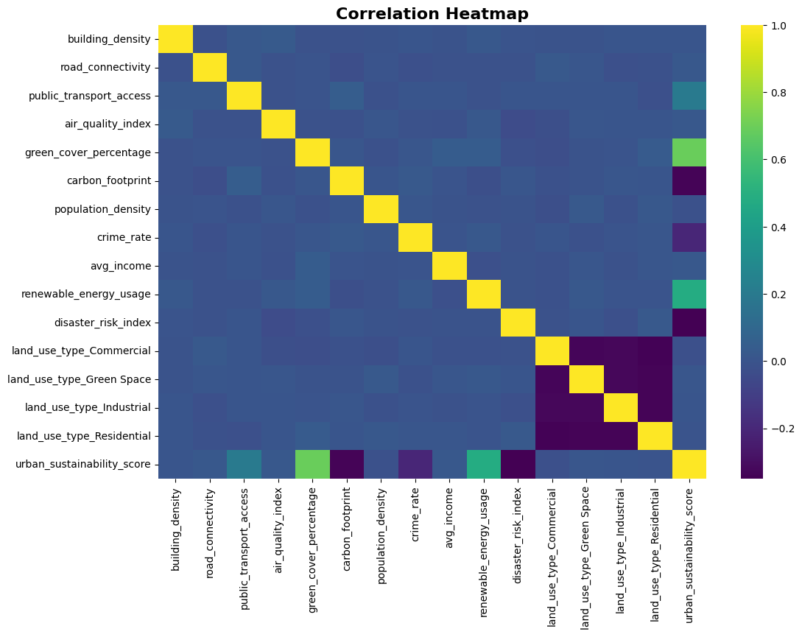 

**Distribution Analysis**  
Kernel Density Estimation (KDE) plots examining feature distributions and patterns.

  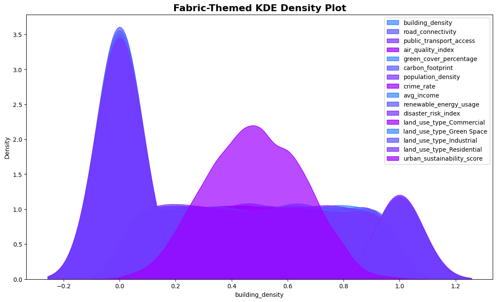 

**Multivariate Relationships**  
Pairplot analysis identifying interactions between key sustainability indicators.

  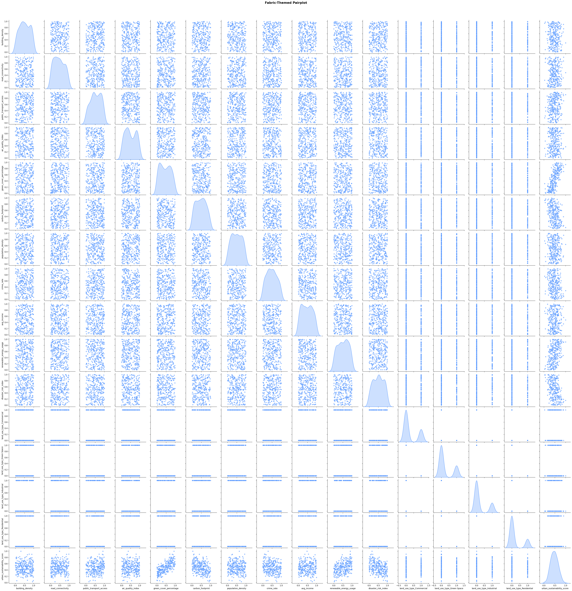 

**Outlier Detection**  
Boxplot analysis detecting anomalies and variability across metrics.

  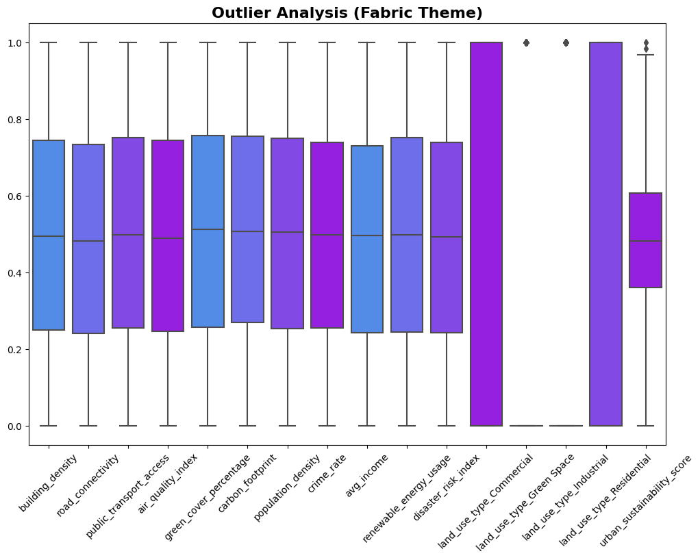 

### 2. Dimensionality Reduction

**Principal Component Analysis (PCA)**  
Reduction of high-dimensional data into 2D space for enhanced visualization and pattern recognition.

  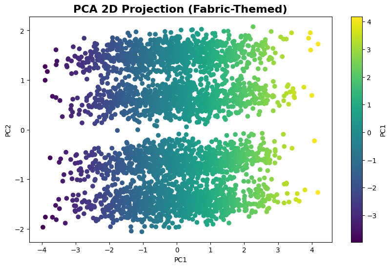 

### 3. Clustering Analysis

**Hierarchical Clustering**  
Dendrogram-based analysis revealing natural groupings among cities.

   

**K-Means Clustering**  
Segmentation of cities into distinct sustainability profiles.

   

### 4. Predictive Modeling

**Primary Model - XGBoost Regression**
- Optimized for structured tabular data.
- Handles non-linear relationships effectively.
- Built-in regularization to prevent overfitting.

**Secondary Model - Random Forest Regression**
- Provides model comparison and validation.
- Strong generalization capabilities.
- Robust feature importance analysis.

**Evaluation Metrics**
- Mean Absolute Error (MAE).
- Root Mean Squared Error (RMSE).
- R² Score.

   

### 5. Model Diagnostics

**Residual Analysis**
- Distribution normality assessment.
- Homoscedasticity verification.
- Bias and outlier detection.

  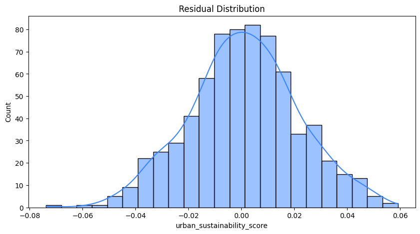 

  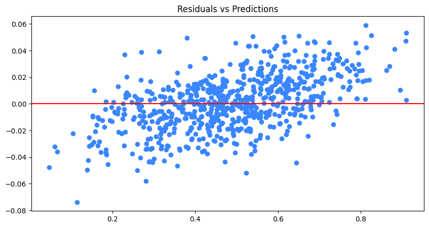 

## Interactive Dashboards Screenshots

  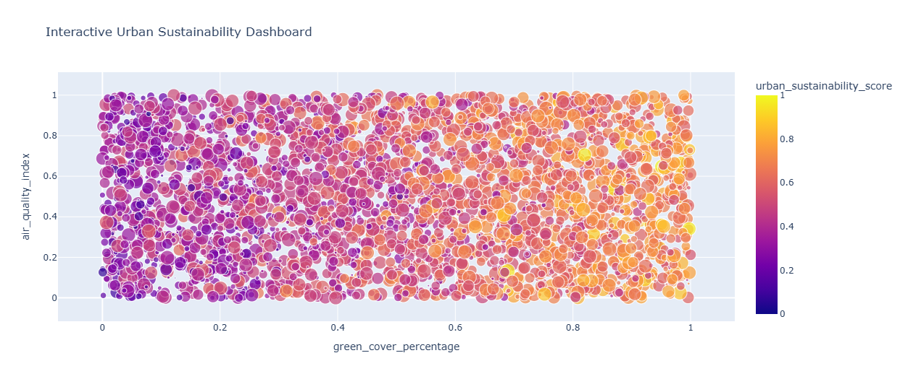 

  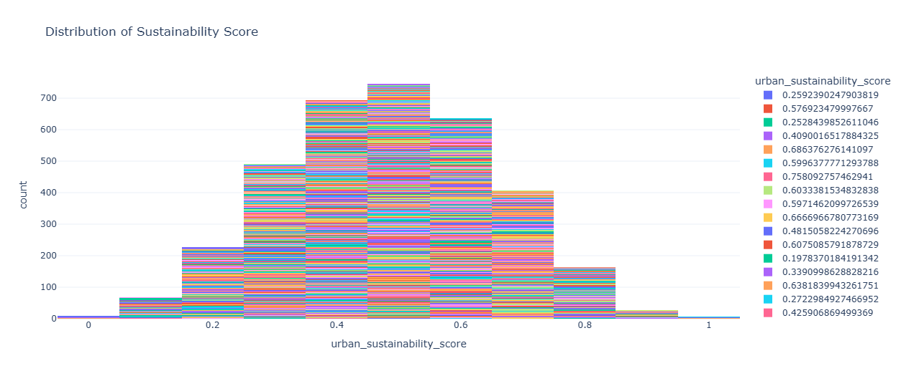 

  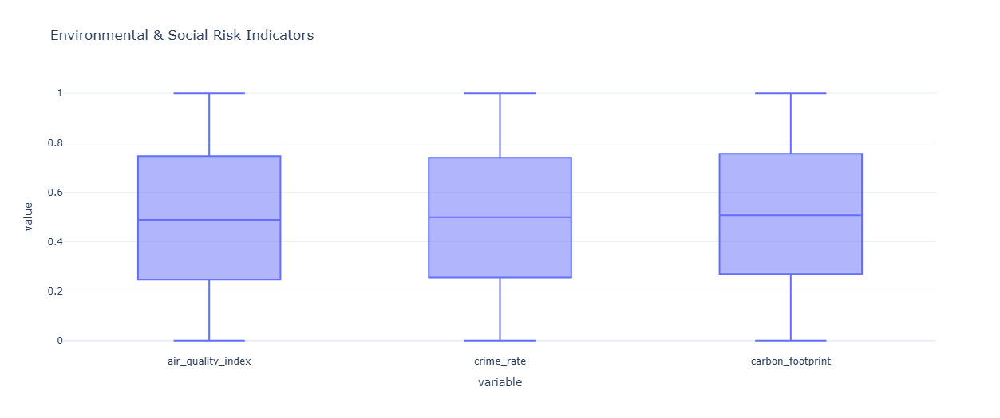 

   

## Key Findings

1. **Renewable Energy Impact** - Cities with higher renewable energy adoption demonstrate significantly superior sustainability scores.

2. **Critical Factors** - Air quality and green cover percentage emerge as the two most influential predictors of urban sustainability.

3. **City Archetypes** - Cluster analysis identified three distinct sustainability profiles -
   - **Renewable Energy Leaders** - Cities prioritizing clean energy infrastructure.
   - **Green Urban Spaces** - High vegetation cover with air quality challenges.
   - **Balanced Developers** - Mid-tier cities with distributed sustainability investments.

4. **Feature Importance Hierarchy** -
   - Renewable energy usage.
   - Pollution control effectiveness.
   - Public transport efficiency.
   - Waste management systems.
   - Green cover percentage.
  

  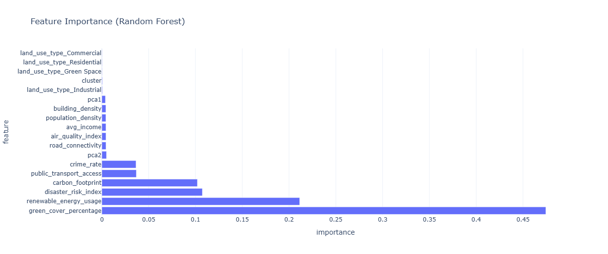 

## Technologies

| Category | Tools & Libraries |
|----------|------------------|
| **Language** | Python 3.x |
| **Data Processing** | Pandas, NumPy |
| **Visualization** | Matplotlib, Seaborn, Plotly |
| **Machine Learning** | Scikit-Learn, XGBoost |
| **Clustering** | K-Means, Hierarchical Clustering |
| **Dimensionality Reduction** | PCA (Principal Component Analysis) |
| **Environment** | Kaggle Notebook, Jupyter |

## Results

The project successfully demonstrates -

- **Predictive Accuracy** - Robust models with strong R² scores and low prediction errors.
- **Interpretability** - Clear feature importance rankings guiding policy priorities.
- **Segmentation** - Meaningful city clusters enabling targeted sustainability strategies.
- **Visualization** - Comprehensive visual analytics facilitating stakeholder communication.

  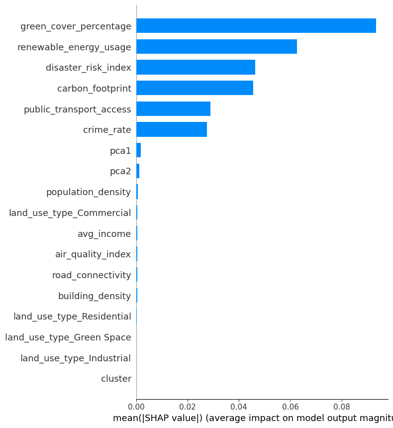 

  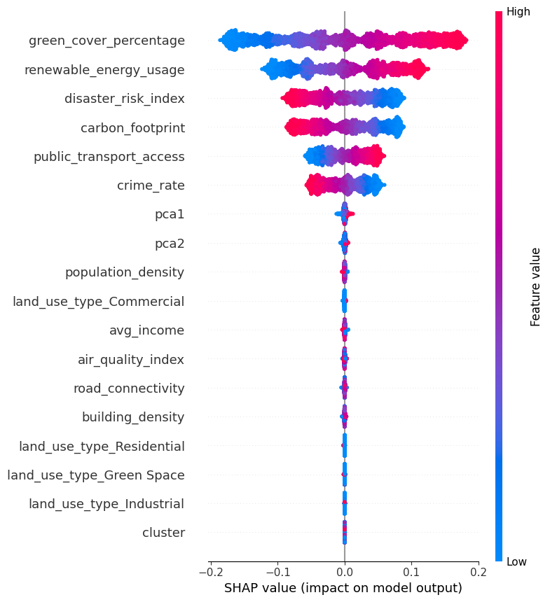 

  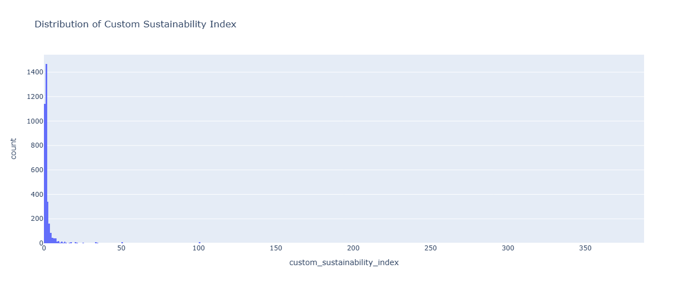 

These insights provide evidence-based guidance for urban development initiatives and sustainability policy formulation.
